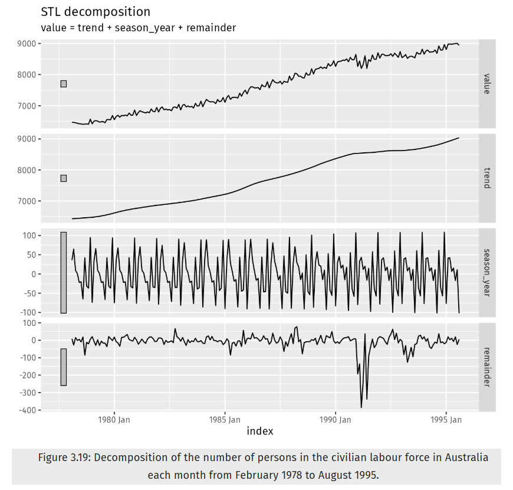
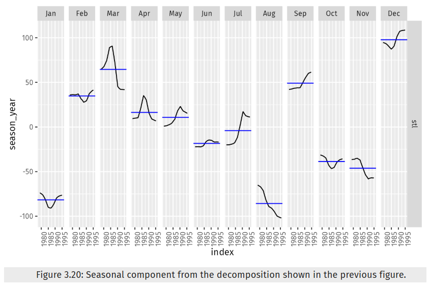

## Load Packages
```{r message=FALSE}
library(fpp3)
library(seasonal)
library(USgas)
```

## Exercise 1
Consider the GDP information in global_economy. Plot the GDP per capita for each country over time. Which country has the highest GDP per capita? How has this changed over time?
```{r message=FALSE, warning=FALSE}
autoplot(global_economy, GDP/Population) +
  labs(title= "GDP per Capita", y = "$US") +
  theme(legend.position = "none")
```

The above plot illustrates the GDP per capita for each country over time. The legend has been removed because the large number of countries was rendering the graph imperceptible. In order to then identify the country with the highest GDP per capita, the code below was performed.
```{r message=FALSE, warning=FALSE}
global_economy %>%
  mutate(GDP_capita = GDP/Population) %>% 
  arrange(desc(GDP_capita))

global_economy %>%
  mutate(GDP_capita = GDP/Population) %>% 
  filter(Code == "MCO" | Code == "LIE", Year == 2016) %>% 
  arrange(desc(GDP_capita))
```

The above tsibbles indicate Monaco to be the country with the highest GDP per capita; a trend that has held true since at least the 1970's with Liechtenstein coming in at a close second.

## Exercise 2
For each of the following series, make a graph of the data. If transforming seems appropriate, do so and describe the effect.

United States GDP from global_economy.
Slaughter of Victorian “Bulls, bullocks and steers” in aus_livestock.
Victorian Electricity Demand from vic_elec.
Gas production from aus_production.
```{r message=FALSE, warning=FALSE}
autoplot(global_economy %>% 
           filter(Country == "United States"), GDP) +
  labs(title= "US GDP")
```

The plot of United States GDP from global_economy is pretty smooth and shouldn't require any transforming since there isn't any variation that would need to be made uniform.
```{r message=FALSE, warning=FALSE}
autoplot(aus_livestock %>% 
           filter(Animal == "Bulls, bullocks and steers",
                  State == "Victoria"), Count) +
  labs(title= "Slaughter of Victorian “Bulls, bullocks and steers”")

lambda_livestock <- aus_livestock %>%
  filter(Animal == "Bulls, bullocks and steers",
                  State == "Victoria") %>% 
  features(Count, features = guerrero) %>% 
  pull(lambda_guerrero)

aus_livestock %>% 
  filter(Animal == "Bulls, bullocks and steers",
         State == "Victoria") %>% 
  autoplot(box_cox(Count, lambda_livestock)) +
  labs(title= "Lambda Transformed Slaughter of Victorian “Bulls, bullocks and steers”")
```

The plot of Slaughter of Victorian “Bulls, bullocks and steers” in aus_livestock did require some transforming since the variation was not constant throughout. Interestingly enough, the value of lambda recommended using the guerrero feature was negative. The plot did seem more uniform after transforming.
```{r message=FALSE, warning=FALSE}
autoplot(vic_elec, Demand) +
  labs(title = "Victorian Electricity Demand")

lambda_elec <- vic_elec %>%
  features(Demand, features = guerrero) %>% 
  pull(lambda_guerrero)

vic_elec %>% 
  autoplot(box_cox(Demand, lambda_elec)) +
  labs(title = "Lambda Transformed Victorian Electricity Demand")
```

The plot of Victorian Electricity Demand from vic_elec was clearly seasonal and so one would expect the variation to also change depending on the time of year. A transformation was able to squeeze in the degree of variation slightly, however, not enough to make a notable difference. When it comes to repetitive data sets such as this one, there doesn't seem to be such an obvious benefit to transformation.
```{r message=FALSE, warning=FALSE}
autoplot(aus_production, Gas) +
  labs(title= "Australian Gas Production")

lambda_gas <- aus_production %>%
  features(Gas, features = guerrero) %>% 
  pull(lambda_guerrero)

aus_production %>% 
  autoplot(box_cox(Gas, lambda_gas)) +
  labs(title = "Lambda Transformed Australian Gas Production")
```

The plot of Gas production from aus_production was apparent in it's need for transformation. The beginning had way less variation than the end. In order to address this, a fitting lambda was calculated using the guerrero feature and a subsequent plot was graphed. The second plot is way more uniform in variation than the first.

## Exercise 3
Why is a Box-Cox transformation unhelpful for the canadian_gas data?
```{r message=FALSE, warning=FALSE}
autoplot(canadian_gas, Volume) +
  labs(title= "Canadian Gas")

lambda_canada <- canadian_gas %>%
  features(Volume, features = guerrero) %>% 
  pull(lambda_guerrero)

canadian_gas %>% 
  autoplot(box_cox(Volume, lambda_canada)) +
  labs(title = "Lambda Transformed Canadian Gas")
```

Box-Cox transformations seem to work by either exaggerating or minimizing already existing variations throughout a plot. This approach is perfect for graphs where there are two predominant patterns of variation within the data set and manipulation of said variation could bring them closer together. However, as is the case with the canadian_gas data, there seems to be no benefit in using Box-Cox transformations when there are more than 2 predominant patterns of variation. The canadian_gas data seems to have one variation in the first third of the data, another variation in the second, and yet another variation in the last third. Applying a Box-Cox transformation seems to squeeze in the variations without really causing them to come any closer to each other. This is to be expected since whatever transformation one chooses to perform is done to the entire data set and not just a portion.

## Exercise 4
What Box-Cox transformation would you select for your retail data (from Exercise 7 in Section 2.10)?
```{r message=FALSE, warning=FALSE}
set.seed(1)
myseries <- aus_retail %>% 
  filter(`Series ID` == sample(aus_retail$`Series ID`,1))

autoplot(myseries, Turnover) +
  labs(title = "Retail Turnovers")

lambda_turnover <- myseries %>%
  features(Turnover, features = guerrero) %>% 
  pull(lambda_guerrero)
lambda_turnover

myseries %>% 
  autoplot(box_cox(Turnover, lambda_turnover)) +
  labs(title = "Lambda Transformed Retail Turnovers")
```

Given the preceding guerrero lambda value and plot shown above, a natural log Box-Cox transformation would be ideal. Although we obtained a lambda of -0.009, this value is much closer to 0 than it is to -1, leading to the use of natural log rather than the inverse plus one.

## Exercise 5
For the following series, find an appropriate Box-Cox transformation in order to stabilize the variance. Tobacco from aus_production, Economy class passengers between Melbourne and Sydney from ansett, and Pedestrian counts at Southern Cross Station from pedestrian.
```{r message=FALSE, warning=FALSE}
autoplot(aus_production, Tobacco) +
  labs(title = "Tobacco and Cigarette Production")

lambda_tobacco <- aus_production %>%
  features(Tobacco, features = guerrero) %>% 
  pull(lambda_guerrero)
lambda_tobacco

aus_production %>% 
  autoplot(box_cox(Tobacco, lambda_tobacco)) +
  labs(title = "Lambda Transformed Tobacco and Cigarette Production")
```
```{r message=FALSE, warning=FALSE}
autoplot(ansett %>% 
           filter(Class == "Economy", Airports == "MEL-SYD"), Passengers) +
  labs(title = "Economy Class Passengers between Melbourne and Sydney")

lambda_econ <- ansett %>%
  filter(Class == "Economy", Airports == "MEL-SYD") %>% 
  features(Passengers, features = guerrero) %>% 
  pull(lambda_guerrero)
lambda_econ

ansett %>% 
  filter(Class == "Economy", Airports == "MEL-SYD") %>% 
  autoplot(box_cox(Passengers, lambda_econ)) +
  labs(title = "Lambda Transformed Economy Class Passengers between Melbourne and Sydney")
```
```{r message=FALSE, warning=FALSE}
autoplot(pedestrian %>% 
           filter(Sensor == "Southern Cross Station"), Count) +
  labs(title = "Pedestrians at Southern Cross Station")

lambda_ped <- pedestrian %>% 
  filter(Sensor == "Southern Cross Station") %>% 
  features(Count, features = guerrero) %>% 
  pull(lambda_guerrero)
lambda_ped

pedestrian %>% 
  filter(Sensor == "Southern Cross Station") %>%
  autoplot(box_cox(Count, lambda_ped)) +
  labs(title = "Lambda Transformed Pedestrians at Southern Cross Station")
```

## Exercise 7
Consider the last five years of the Gas data from aus_production.

```{r message=FALSE, warning=FALSE}
gas <- tail(aus_production, 5*4) |> select(Gas)
```

Plot the time series. Can you identify seasonal fluctuations and/or a trend-cycle?
Use classical_decomposition with type=multiplicative to calculate the trend-cycle and seasonal indices.
Do the results support the graphical interpretation from part a?
Compute and plot the seasonally adjusted data.
Change one observation to be an outlier (e.g., add 300 to one observation), and recompute the seasonally adjusted data. What is the effect of the outlier?
Does it make any difference if the outlier is near the end rather than in the middle of the time series?
```{r message=FALSE, warning=FALSE}
autoplot(gas)
```

The above plot illustrates strong seasonal fluctuation where gas production in Australia seems to dip Q4 and Q1 just to bounce back up for Q2 and Q3. The plot also has an upward trend where all quarters for next year's cycle have a higher value than their respective quarters for the preceding year.
```{r message=FALSE, warning=FALSE}
gas %>%
  model(cd = classical_decomposition(Gas, type = "multiplicative")) %>%
  components()
```

Above is the resulting 'dable' from running the Gas data through classical decomposition with type = multiplicative. As we can see, values in the Gas field are correctly represented by the values found in the trend, seasonal, and random fields; these three fields multiplied give us what we see for their respective Gas value. This support the graphical interpretation from part a.
```{r message=FALSE, warning=FALSE}
gas %>%
  model(cd = classical_decomposition(Gas, type = "multiplicative")) %>%
  components() %>%
  as_tsibble() %>%
  autoplot(season_adjust)
```

The above plot is an illustration of the seasonally adjusted data. One must first convert the resulting dable into a tsibble to then be able to autoplot the season_adjust field as a time series.
```{r message=FALSE, warning=FALSE}
gas_outlier <- gas
gas_outlier$Gas[7] <- gas_outlier$Gas[7] + 300
gas_outlier %>% 
  model(cd = classical_decomposition(Gas, type = "multiplicative")) %>%
  components()
gas_outlier %>% 
  model(cd = classical_decomposition(Gas, type = "multiplicative")) %>%
  components() %>% 
  as_tsibble() %>% 
  autoplot(season_adjust)
```

Choosing an outlier towards the center of the data set results in more volatility throughout the rest of the seasonally adjusted data. Although data points farthest from the outlier seem to be closer to the values of the original, as we get closer to the outlier, so do the data points get farther from the original values.
```{r message=FALSE, warning=FALSE}
gas_outlier1 <- gas
gas_outlier1$Gas[20] <- gas_outlier1$Gas[20] + 300
gas_outlier1 %>% 
  model(cd = classical_decomposition(Gas, type = "multiplicative")) %>%
  components()
gas_outlier1 %>% 
  model(cd = classical_decomposition(Gas, type = "multiplicative")) %>%
  components() %>% 
  as_tsibble() %>% 
  autoplot(season_adjust)
```

As can be seen in the dable and plot above, the position of the outlier does seem to influence its impact on the rest of the data points. Choosing an outlier towards the ends of the data set, or plot, appears to align much better with the original data set up until the arrival of the outlier as oppose to the volatility we saw in part e.

## Exercise 8
Recall your retail time series data (from Exercise 7 in Section 2.10). Decompose the series using X-11. Does it reveal any outliers, or unusual features that you had not noticed previously?
```{r message=FALSE, warning=FALSE}
myseries %>% 
  model(x11 = X_13ARIMA_SEATS(Turnover ~ x11())) %>%
  components()

myseries %>% 
  model(x11 = X_13ARIMA_SEATS(Turnover ~ x11())) %>%
  components() %>%
  autoplot()

myseries %>% 
  model(x11 = X_13ARIMA_SEATS(Turnover ~ x11())) %>%
  components() %>%
  as_tsibble() %>% 
  autoplot(season_adjust)
```

The retail time series data (from Exercise 7 in Section 2.10), also known as 'myseries', perfectly illustrated how the number of turnovers had an upward trend throughout the data set with only a slight downturn between the years of 2005 and 2010. The above decomposed data, however, brings to light a few inconspicuous outliers between the years 1985 and 1990 and directly after 2000 in the irregularities component. We also see that the variability in seasonality grew throughout the years and that the downturn between 2005 and 2010 appear in the trend and irregularities components. In addition, the plot for the seasonally_adjusted data also clarifies that the 1999-2001 dip seen in the irregularities was an actual downturn which would have otherwise been attributed as part of seasonality in the original plot.

## Exercise 9
[Figures 3.19 and 3.20](https://otexts.com/fpp3/decomposition-exercises.html) show the result of decomposing the number of persons in the civilian labour force in Australia each month from February 1978 to August 1995.

Write about 3–5 sentences describing the results of the decomposition. Pay particular attention to the scales of the graphs in making your interpretation.
Is the recession of 1991/1992 visible in the estimated components?
```{r message=FALSE, warning=FALSE}

```

Image 1: Chapter 3 Exercise 9 STL Decomposition (3.7 Exercises | Forecasting: Principles and Practice (3rd Ed), 2025)

```{r message=FALSE, warning=FALSE}

```

Image 2: Chapter 3 Exercise 9 Seasonal Component (3.7 Exercises | Forecasting: Principles and Practice (3rd Ed), 2025)

Looking at the STL decomposition plots, one can see an obvious upward trend throughout the data only slightly plateauing somewhere between the years 1990 and 1995. The seasonality held the same pattern throughout the series but had an increased distance between maximums towards the final years. The remainder showed an exaggerated dip somewhere between 1990 and 1992.

Observing Figures 3.19 and 3.20, one could say the recession of 1991/1992 is visible in the estimated components. This is especially true when looking at the remainder component of the decomposition and is slightly detectable in the trend component. The seasonal plot also illustrates the recession in that all months were going either downward or plateauing from 1990 to 1995 with the exceptions of February, September and October.

## Works Cited
3.7 Exercises | Forecasting: Principles and Practice (3rd ed). (2025). Otexts.com. https://otexts.com/fpp3/decomposition-exercises.html
