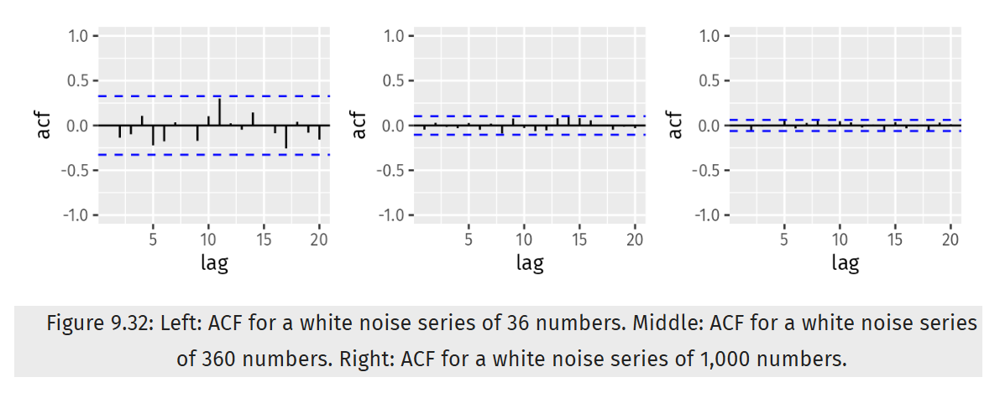

## Load Packages
```{r message=FALSE, warning=FALSE}
library(fpp3)
library(seasonal)
library(USgas)
```

## Exercise 1
Figure 9.32 shows the ACFs for 36 random numbers, 360 random numbers and 1,000 random numbers.

```{r message=FALSE, warning=FALSE}

```

Image 1: Chapter 9 Exercise 1 ACFs (9.11 Exercises | Forecasting: Principles and Practice (3rd Ed), 2025)

Explain the differences among these figures. Do they all indicate that the data are white noise?

The ACF limits shorten as the number of random numbers rises. Each of the above ACF plots indicates that the data is white noise since the majority of the lag data for each chart falls within the ACF bounds.

Why are the critical values at different distances from the mean of zero? Why are the autocorrelations different in each figure when they each refer to white noise?

Due to the rule of large numbers, the critical values are at varying distances from the zero mean. The number of outliers from the mean reduces as there are more observations. Furthermore, because the series is made up of random values, the autocorrelations vary from figure to figure. As a result, the autocorrelations will exhibit random behavior.

## Exercise 2
A classic example of a non-stationary series are stock prices. Plot the daily closing prices for Amazon stock (contained in `gafa_stock`), along with the ACF and PACF. Explain how each plot shows that the series is non-stationary and should be differenced.
```{r message=FALSE, warning=FALSE}
amzn <- gafa_stock %>% 
  filter(Symbol == 'AMZN')

gg_tsdisplay(amzn, Close, plot_type = 'partial')
```

As can be seen above, the ACF figure demonstrates that autocorrelation levels decrease over time. Both the ACF and PACF plots appear to show seasonality, and the majority of the lags fall outside of the bounds, indicating that the data is not white noise. Furthermore, the series graph indicates an upward trend in the data, followed by a dramatic dip, and then another upward trend.

## Exercise 3
For the following series, find an appropriate Box-Cox transformation and order of differencing in order to obtain stationary data.

Turkish GDP from `global_economy`.
```{r message=FALSE, warning=FALSE}
turk_GDP <- global_economy %>%
  filter(Country == 'Turkey')

gg_tsdisplay(turk_GDP, GDP, plot_type = 'partial')

gg_tsdisplay(turk_GDP, difference(GDP), plot_type='partial')

lambda <- turk_GDP %>%
  features(GDP, features = guerrero) %>%
  pull(lambda_guerrero)

gg_tsdisplay(turk_GDP, difference(box_cox(GDP, lambda)),plot_type = 'partial')
```

Accommodation takings in the state of Tasmania from `aus_accommodation`.
```{r message=FALSE, warning=FALSE}
tas_accom <- aus_accommodation %>%
  filter(State == 'Tasmania')

gg_tsdisplay(tas_accom, Takings, plot_type = 'partial')

features(tas_accom, Takings, unitroot_nsdiffs) 

gg_tsdisplay(tas_accom, difference(Takings,4), plot_type = 'partial')

lambda <- tas_accom %>%
  features(Takings, features = guerrero) %>%
  pull(lambda_guerrero)

gg_tsdisplay(tas_accom, difference(box_cox(Takings,lambda),12), plot_type = 'partial')
```

Monthly sales from `souvenirs`.
```{r message=FALSE, warning=FALSE}
gg_tsdisplay(souvenirs, difference(Sales,12), plot_type = 'partial')

lambda <- souvenirs %>%
  features(Sales, features = guerrero) %>%
  pull(lambda_guerrero)

gg_tsdisplay(souvenirs, difference(box_cox(Sales,lambda),12), plot_type = 'partial')
```

## Exercise 5
For your retail data (from Exercise 7 in Section 2.10), find the appropriate order of differencing (after transformation if necessary) to obtain stationary data.
```{r message=FALSE, warning=FALSE}
set.seed(1)
myseries <- aus_retail %>% 
  filter(`Series ID` == sample(aus_retail$`Series ID`,1))

autoplot(myseries) +
  labs(title = 'Retail Turnovers')

gg_tsdisplay(myseries, Turnover, plot_type = 'partial', lag = 72)

gg_tsdisplay(myseries, difference(Turnover,12), plot_type='partial', lag =36)

gg_tsdisplay(myseries, difference(Turnover,12) %>% difference(), plot_type='partial', lag =36)
```

## Exercise 6
Simulate and plot some data from simple ARIMA models.

Use the following R code to generate data from an AR(1) model with phi[1]=0.6 and sigma^2=1. The process starts with y[1]=0.
```{r message=FALSE, warning=FALSE}
AR_sim<- function(phi) {
 data <-  tsibble(
    date = as.Date("2017-01-01") + 0:99,
    y = numeric(100),
    e = rnorm(100)
  )
  for(i in 2:100)
    data$y[i] <- phi*data$y[i-1] + data$e[i]
   data %>% gg_tsdisplay(y=y,plot_type = 'partial')
}
AR_sim(.06)
```

Produce a time plot for the series. How does the plot change as you change phi[1]?
```{r message=FALSE, warning=FALSE}
AR_sim(0)

AR_sim(0.5)

AR_sim(1)
```

As can be seen above, as phi[1] increases, chart variation becomes more diffused.

Write your own code to generate data from an MA(1) model with theta[1]=0.6 and sigma^2=1.
```{r message=FALSE, warning=FALSE}
MA_sim<- function(theta) {
 data <-  tsibble(
    date = as.Date("2017-01-01") + 0:99,
    y = numeric(100),
    e = rnorm(100)
  )
  for(i in 2:100)
    data$y[i] <- theta*data$e[i-1] + data$e[i]
   data %>% gg_tsdisplay(y=y,plot_type = 'partial')
}
MA_sim(0.6)
```

Produce a time plot for the series. How does the plot change as you change theta[1]?
```{r message=FALSE, warning=FALSE}
MA_sim(0)

MA_sim(0.5)

MA_sim(1)
```

As the above plots show, increasing the value of theta[1] leads to more volatility in y.

Generate data from an ARMA(1,1) model with phi[1]=0.6, theta[1]=0.6 and sigma^2=1.
```{r message=FALSE, warning=FALSE}
ARMA_sim<- function(phi,theta) {
 data <-  tsibble(
    date = as.Date("2017-01-01") + 0:99,
    y = numeric(100),
    e = rnorm(100)
  )
  for(i in 2:100)
    data$y[i] <- phi*data$y[i-1] + theta*data$e[i-1]+ data$e[i]
   data %>% gg_tsdisplay(y=y,plot_type = 'partial')
}
ARMA_sim(.6,.6)
```

Generate data from an AR(2) model with phi[1]=-0.8, phi[2]=0.3 and sigma^2=1. (Note that these parameters will give a non-stationary series.)
```{r message=FALSE, warning=FALSE}
AR2_sim<- function(phi1,phi2) {
 data <-  tsibble(
    date = as.Date("2017-01-01") + 0:99,
    y = numeric(100),
    e = rnorm(100)
  )
  for(i in 3:100)
    data$y[i] <- phi1*data$y[i-1] + phi2*data$y[i-2]+ data$e[i]
   data %>% gg_tsdisplay(y=y,plot_type = 'partial')
}
AR2_sim(-.8,.3)
```

Graph the latter two series and compare them.

The absence of a trend, seasonality, or cycle gives the graph from section e the appearance of being stationary. There is no steady nature to the graph in section f. The autocorrelation is high, and the variance is growing at an exponential rate.

## Exercise 7
Consider `aus_airpassengers`, the total number of passengers (in millions) from Australian air carriers for the period 1970-2011.

Use `ARIMA()` to find an appropriate ARIMA model. What model was selected. Check that the residuals look like white noise. Plot forecasts for the next 10 periods.
```{r message=FALSE, warning=FALSE, error=TRUE}
pass <- aus_airpassengers %>%
  filter(Year <= 2011)

pass_fit <- pass %>%
  model(ARIMA(Passengers))

report(pass_fit)

pass_fit %>%
  forecast(h=10) %>%
  autoplot(pass)

pass_fit %>% 
  gg_tsresiduals()
```

For some odd reason, I am not getting anything back for the model.

Write the model in terms of the backshift operator.

Wish I could, but since I can't see what the model is I can't determine which backshift operator to use.

Plot forecasts from an ARIMA(0,1,0) model with drift and compare these to part a.
```{r message=FALSE, warning=FALSE}
pass_fit2 <- pass %>%
  model(ARIMA(Passengers ~ pdq(0,1,0))) 

pass_fit2 %>%
  forecast(h=10) %>% 
  autoplot(pass)

pass_fit2 %>%
  gg_tsresiduals()
```

Plot forecasts from an ARIMA(2,1,2) model with drift and compare these to parts a and c. Remove the constant and see what happens.
```{r message=FALSE, warning=FALSE}
pass_fit3 <- pass %>%
  model(ARIMA(Passengers ~ 1 + pdq(2,1,2))) 

pass_fit3 %>%
  forecast(h=10) %>% 
  autoplot(pass)

pass_fit3 %>%
  gg_tsresiduals()

pass_fit3_noC <- pass %>%
  model(ARIMA(Passengers ~ pdq(2,1,2))) 

pass_fit3_noC %>% 
  gg_tsresiduals()
```

Removing the constant seems to bear no difference in the resulting plots.

Plot forecasts from an ARIMA(0,2,1) model with a constant. What happens?
```{r message=FALSE, warning=FALSE}
pass_fit4 <- pass %>%
  model(ARIMA(Passengers ~ 1 + pdq(0,2,1))) 

pass_fit4 %>% 
  gg_tsresiduals()
```

Plotting forecasts from an ARIMA(0,2,1) model with a constant seems to shift the innovation residuals plot and cause changes to the ACF and .resid distribution plots.

## Exercise 8
For the United States GDP series (from `global_economy`):

if necessary, find a suitable Box-Cox transformation for the data;
```{r message=FALSE, warning=FALSE}
us_GDP <- global_economy %>%
  filter(Country == "United States")

us_GDP %>%
  gg_tsdisplay(GDP)

us_GDP_log <- us_GDP %>%
  mutate(GDP = log(GDP))
us_GDP_log %>%
  gg_tsdisplay(GDP)

us_GDP_log_d <- us_GDP_log %>%
  mutate(gdp_diff = difference(GDP,1))
us_GDP_log_d %>%
  gg_tsdisplay(gdp_diff, plot_type = 'partial')

us_GDP_log_d2 <- us_GDP_log %>%
  mutate(gdp_diff = difference(GDP,2))
us_GDP_log_d2 %>%
  gg_tsdisplay(gdp_diff, plot_type = 'partial')
```

fit a suitable ARIMA model to the transformed data using `ARIMA()`;
```{r message=FALSE, warning=FALSE, error=TRUE}
gdp_fit <- us_GDP_log_d %>%
  model(ARIMA(gdp_diff))
gdp_fit

gdp_fit %>%
  gg_tsresiduals()
```

Same issue as before; no model produced.

try some other plausible models by experimenting with the orders chosen;
```{r message=FALSE, warning=FALSE, error=TRUE}
gdp_fit2 <- us_GDP_log_d2 %>%
  model(ARIMA(gdp_diff))
gdp_fit2

gdp_fit2 %>%
  gg_tsresiduals()

us_GDP_log_d3 <- us_GDP_log %>%
  mutate(gdp_diff = difference(GDP,3))
us_GDP_log_d3 %>%
  gg_tsdisplay(gdp_diff, plot_type = 'partial')

gdp_fit3 <- us_GDP_log_d3 %>%
  model(ARIMA(gdp_diff))
gdp_fit3

gdp_fit3 %>%
  gg_tsresiduals()
```

Still having issues producing ARIMA models even though the code looks fine

choose what you think is the best model and check the residual diagnostics;
```{r message=FALSE, warning=FALSE}
gdp_models <- us_GDP_log %>%
  model(one = ARIMA(GDP ~ 1 + pdq(0,1,1)),
        two = ARIMA(GDP ~  pdq(0,2,0)),
        three= ARIMA(GDP ~ 1 + pdq(1,1,1)))
glance(gdp_models) %>%
  arrange(AICc) %>%
  select(.model:BIC)
```

produce forecasts of your fitted model. Do the forecasts look reasonable?
```{r message=FALSE, warning=FALSE}
gdp_models %>%
  forecast(h=10) %>%
  filter(.model=='three') %>%
  autoplot(us_GDP_log)
```

compare the results with what you would obtain using `ETS()` (with no transformation).
```{r message=FALSE, warning=FALSE}
ets <- us_GDP %>%
  model(ETS(GDP))

report(ets)

ets %>%
  forecast(h=10) %>%
  autoplot(us_GDP)
```

The 95% CI for the forecast made by the ARIMA model is smaller. Additionally, its mean prediction line is not as steep than that of the ETS model. Given that its forecasts fall within a smaller range, it appears that the ARIMA model has greater confidence in its forecast.

## Works Cited
9.11 Exercises | Forecasting: Principles and Practice (3rd ed). (2025). Otexts.com. https://otexts.com/fpp3/arima-exercises.html