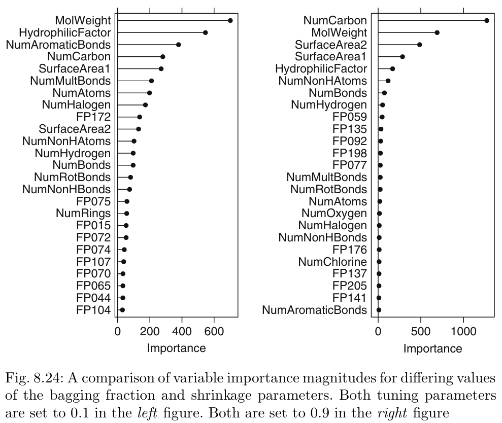

## Load Packages
```{r message=FALSE, warning=FALSE}
library(AppliedPredictiveModeling)
library(caret)
library(corrplot)
library(earth)
library(e1071)
library(elasticnet)
library(grplasso)
library(kernlab)
library(lars)
library(MASS)
library(mlbench)
library(nnet)
library(penalized)
library(pls)
library(stats)
library(tidyverse)
library(VIM)
library(rpart)
library(Cubist)
library(gbm)
library(ipred)
library(party)
library(partykit)
library(randomForest)
```

## Exercise 1
Recreate the simulated data from Exercise 7.2:
```{r message=FALSE, warning=FALSE}
set.seed(91)
simulated <- mlbench.friedman1(200, sd = 1)
simulated <- cbind(simulated$x, simulated$y)
simulated <- as.data.frame(simulated)
colnames(simulated)[ncol(simulated)] <- "y"
```

Fit a random forest model to all of the predictors, then estimate the variable importance scores:
```{r message=FALSE, warning=FALSE}
model1 <- randomForest(y ~ .,
                       data = simulated,
                       importance = TRUE,
                       ntree = 1000)
rfImp1 <- varImp(model1, scale = FALSE)
```

Did the random forest model significantly use the uninformative predictors (V6– V10)?
```{r message=FALSE, warning=FALSE}
rfImp1
```

Given the above table, one can say with confidence that the uninformative predictors V6 - V10 were not used by the random forest model significantly.

Now add an additional predictor that is highly correlated with one of the informative predictors. For example:
```{r message=FALSE, warning=FALSE}
simulated$duplicate1 <- simulated$V1 + rnorm(200) * .1
cor(simulated$duplicate1, simulated$V1)
```

Fit another random forest model to these data. Did the importance score for V1 change? What happens when you add another predictor that is also highly correlated with V1?
```{r message=FALSE, warning=FALSE}
set.seed(92)
rf_model <- randomForest(y ~ .,
                         data = simulated,
                         importance = TRUE,
                         ntree = 1000)
rf_imp <- varImp(rf_model, scale = FALSE)
rf_imp

simulated$duplicate2 <- simulated$V2 + rnorm(200) * .1

set.seed(93)
rf_model1 <- randomForest(y ~ .,
                          data = simulated,
                          importance = TRUE,
                          ntree = 1000)
rf_imp1 <- varImp(rf_model1, scale = FALSE)
rf_imp1
```

Adding an additional predictor that is highly correlated with one of the informative predictors like V1 does cause a change in the importance score for all of the variables. In this case, duplicating V1 caused it to suffer the most. However, when creating a duplicate of a different highly correlated predictor such as V2, it seems as though V1 recovered a little while V2 dropped further.

Use the `cforest` function in the `party` package to fit a random forest model using conditional inference trees. The `party` package function `varimp` can calculate predictor importance. The conditional argument of that function toggles between the traditional importance measure and the modified version described in Strobl et al. (2007). Do these importances show the same pattern as the traditional random forest model?
```{r message=FALSE, warning=FALSE}
simulated <- simulated %>% 
  select(c(-(starts_with("d"))))

set.seed(94)
cf_model <- cforest(y ~ .,
                    data = simulated,
                    ntree = 1000)
cf_imp <- varimp(cf_model, conditional = TRUE)
cf_imp
```

As can be seen in the above results, the conditional influence model does seem to show a similar pattern to that of the random forest one although not with the same magnitudes. The similarities are shown more in the fact that V1 continues to dominate, V3 continues to be a dipping point, and V6 - V10 continue to be seldom used if at all.

Repeat this process with different tree models, such as boosted trees and Cubist. Does the same pattern occur?
```{r message=FALSE, warning=FALSE}
gbm_grid <- expand.grid(interaction.depth = seq(1, 7, by = 2),
                        n.trees = seq(100, 1000, by = 50),
                        shrinkage = c(0.01, 0.1),
                        n.minobsinnode = 10)
set.seed(95)
gbm_model <- train(y ~ .,
                   data = simulated,
                   method = "gbm",
                   tuneGrid = gbm_grid,
                   verbose = FALSE)
gbm_imp <- varImp(gbm_model$finalModel, scale = FALSE)
gbm_imp

set.seed(96)
c_model <- train(y ~ .,
                 data = simulated,
                 method = "cubist",)
c_imp <- varImp(c_model$finalModel, scale = FALSE)
c_imp
```

After testing for both boosted trees and Cubist models, it seems that boosted trees do follow the same pattern as previously seen however Cubist deviates from the pattern making V2 dominant and actually making use of V7.

## Exercise 2
Use a simulation to show tree bias with different granularities.
```{r message=FALSE, warning=FALSE}
set.seed(97)

x <- sample(1:50 / 10, 100, replace = TRUE)
y <- sample(1:100 / 100, 100, replace = TRUE)
z <- sample(1:500 / 1000, 100, replace = TRUE)

xyz <- x + y + z

sim <- data.frame(x,y,z,xyz)
rp_model <- rpart(y ~ .,
                   data = sim)
plot(as.party(rp_model), gp = gpar(fontsize = 7))

varImp(rp_model)
```

As can be seen above, if a variable has a lot of different values, the tree tends to pick that one instead of the others. There's a greater chance that the model will choose the noisy variables over the useful ones at the top nodes.

## Exercise 3
In stochastic gradient boosting the bagging fraction and learning rate will govern the construction of the trees as they are guided by the gradient. Although the optimal values of these parameters should be obtained through the tuning process, it is helpful to understand how the magnitudes of these parameters affect magnitudes of variable importance. Figure 8.24 provides the variable importance plots for boosting using two extreme values for the bagging fraction (0.1 and 0.9) and the learning rate (0.1 and 0.9) for the solubility data. The left-hand plot has both parameters set to 0.1, and the right-hand plot has both set to 0.9:
```{r message=FALSE, warning=FALSE}

```

Image 1: Chapter 8 Exercise 3 comparison of variable importance magnitudes for differing values of the bagging fraction and shrinkage parameters (Kuhn et al., 2016)

Why does the model on the right focus its importance on just the first few of predictors, whereas the model on the left spreads importance across more predictors?

Boosting has a sharper importance profile than random forests because its trees depend on each other, leading to similar structures and higher importance scores for the same predictors. Increasing the learning rate and bagging fraction makes the model behave more like boosting, while lowering these values allows more predictors to gain importance.

Which model do you think would be more predictive of other samples?

Models with a smaller number of key predictors tend to be more accurate compared to those with more, since this approach lowers the risk of overfitting.

How would increasing interaction depth affect the slope of predictor importance for either model in Fig. 8.24?

Increasing interaction depth would lessen the steepness of predictor importance for the model on the left, but it would have a lesser impact on the model on the right.

## Exercise 7
Refer to Exercises 6.3 and 7.5 which describe a chemical manufacturing process. Use the same data imputation, data splitting, and pre-processing steps as before and train several tree-based models:
```{r message=FALSE, warning=FALSE}
data(ChemicalManufacturingProcess)
cmp <- kNN(ChemicalManufacturingProcess, k = 5) %>% 
  select(c(1:58)) %>%
  select(!nearZeroVar(.))

set.seed(98)
ctrl1 <- trainControl(method = "cv", number = 10)
split <- createDataPartition(cmp$Yield, p = 0.8, list = FALSE)
train.data  <- cmp[split, ]
test.data <- cmp[-split, ]

set.seed(99)
st_model <- train(Yield ~ .,
                  data = train.data,
                  method = "rpart",
                  tuneLength = 10,
                  trControl = ctrl1)
st_pred <- predict(st_model, test.data)

set.seed(100)
bt_model <- bagging(Yield ~ .,
                      data = train.data)
bt_pred <- predict(bt_model, test.data)

set.seed(101)
rf_model2 <- randomForest(Yield ~ .,
                        data = train.data, 
                        importance = TRUE,
                        ntree = 1000)
rf_pred <- predict(rf_model2, test.data)

gbm_grid1 <- expand.grid(interaction.depth = seq(1, 7, by = 2),
                         n.trees = seq(100, 1000, by = 50),
                         shrinkage = c(0.01, 0.1),
                         n.minobsinnode = 10)
set.seed(102)
gbm_model1 <- train(Yield ~ .,
                    data = train.data,
                    method = "gbm",
                    tuneGrid = gbm_grid1,
                    verbose = FALSE)
gbm_pred <- predict(gbm_model1, test.data)

set.seed(103)
c_model1 <- train(Yield ~ .,
                  data = train.data,
                  method = "cubist")
c_pred <- predict(c_model1, test.data)
```

Which tree-based regression model gives the optimal resampling and test set performance?
```{r message=FALSE, warning=FALSE}
postResample(st_pred, test.data$Yield)
postResample(bt_pred, test.data$Yield)
postResample(rf_pred, test.data$Yield)
postResample(gbm_pred, test.data$Yield)
postResample(c_pred, test.data$Yield)
```

As we can see from the results above, the boosted tree model (`gbm_model1`) outperformed all other models obtaining an RMSE value of 0.9072270, R^2 of 0.8231149, and an MAE of 0.6145274.

Which predictors are most important in the optimal tree-based regression model? Do either the biological or process variables dominate the list? How do the top 10 important predictors compare to the top 10 predictors from the optimal linear and nonlinear models?
```{r message=FALSE, warning=FALSE}
set.seed(104)
ridge_grid1 <- data.frame(.lambda = seq(0.001, 0.5, length = 25))
ridge_model1 <- train(Yield ~ .,
                     data = train.data,
                     method = "ridge",
                     metric = "Rsquared",
                     tuneGrid = ridge_grid1,
                     trControl = ctrl1,
                     preProc = c("center", "scale"))

set.seed(105)
svm_model1 <- train(Yield ~ .,
                    data = train.data,
                    method = "svmRadial",
                    trControl = ctrl1,
                    preProcess = c("center","scale"),
                    tuneLength = 10)
svm_pred1 <- predict(svm_model1, newdata = test.data)

varImp(gbm_model1)
varImp(ridge_model1)
varImp(svm_model1)
```

The first of the above data frames displays which predictors are most important in the boosted tree model built previously. Out of the top 10 predictors, it seems like the manufacturing process variables dominate the list. Compared to the the top 10 predictors from the optimal linear model (the ridge model seen above) and the optimal nonlinear model (the SVM model below the ridge model), the top 10 important predictors from this model include `BiologicalMaterial03`, `BiologicalMaterial12`, `ManufacturingProcess13`, `ManufacturingProcess17`, `ManufacturingProcess31`, and `ManufacturingProcess32`, but exclude `BiologicalMaterial02`, `BiologicalMaterial06`, `ManufacturingProcess29`, and `ManufacturingProcess36`. However, `ManufacturingProcess32` continues to be of most importance.

Plot the optimal single tree with the distribution of yield in the terminal nodes. Does this view of the data provide additional knowledge about the biological or process predictors and their relationship with yield?
```{r message=FALSE, warning=FALSE}
set.seed(106)
rp_model1 <- rpart(Yield ~ .,
                   data = train.data)
plot(as.party(rp_model1), ip_args = list(abbreviate = 4), gp = gpar(fontsize = 7))
```

As can be seen above, this view of the data does provide additional knowledge about the biological or process predictors and their relationship with yield. The main takeaways being that the main factors that influence yield are related to manufacturing processes, and these processes play a much bigger role in determining yield.

## Works Cited

Kuhn, M., Johnson, K., & Springer Science+Business Media. (2016). Applied predictive modeling. Springer.
